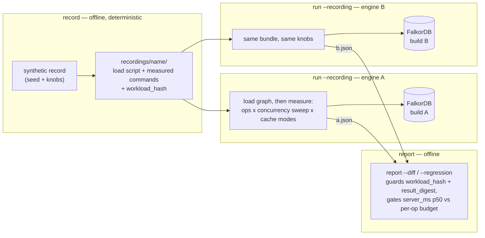
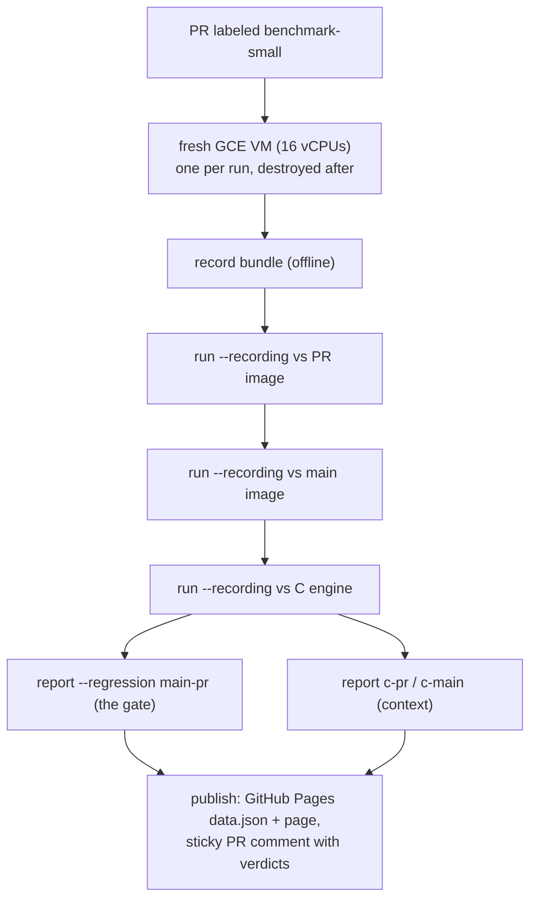
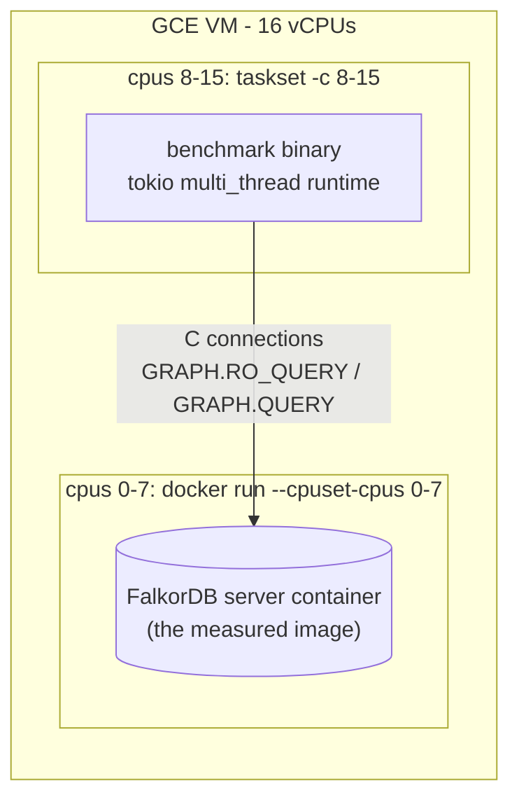
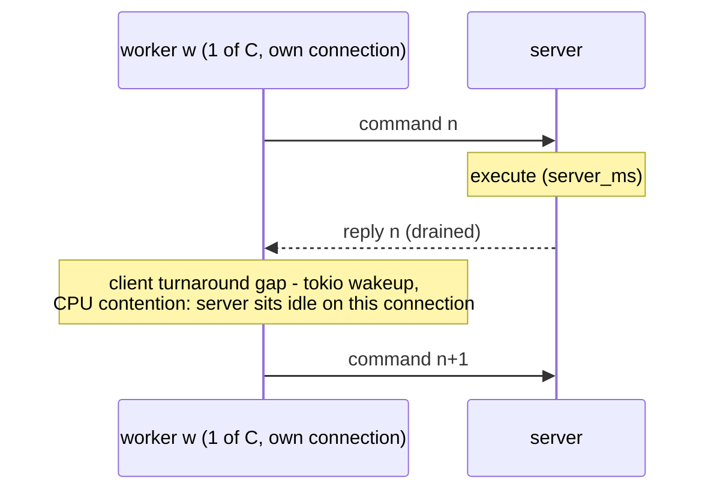
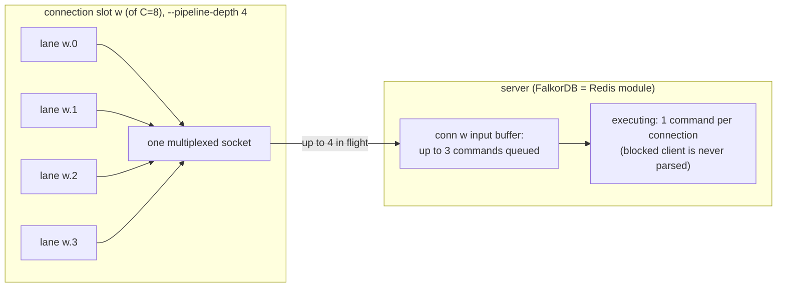
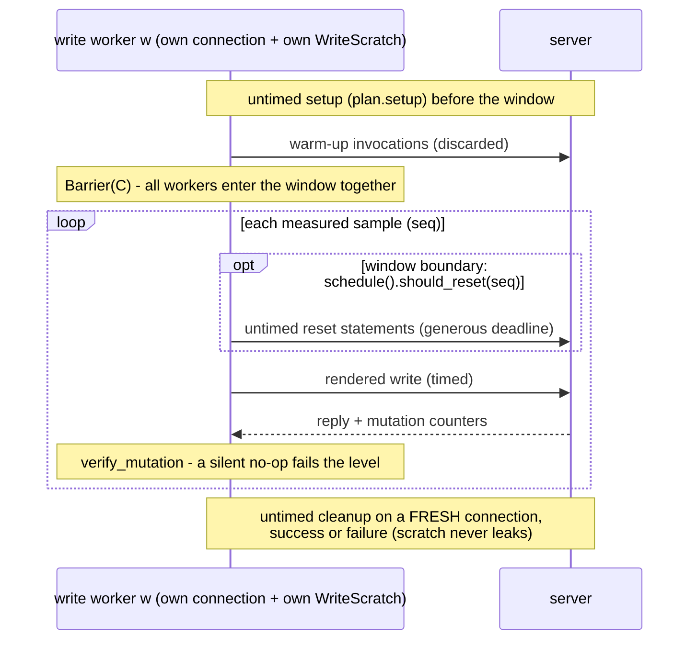

# Synthetic benchmark architecture

How the synthetic per-operation benchmark is put together, in diagrams with links to the code:
where **CPU pinning** happens, how **in-flight requests are gated** (one per connection vs `K`
pipelined lanes), how **write operations** are handled, how **`--client-threads` relates to
`--pipeline-depth`**, and what **run-to-run precision** the pinned + pipelined setup actually
measures. Companion to the conceptual [synthetic benchmark
tutorial](synthetic-benchmark-tutorial.md), the task-oriented
[cookbook](synthetic-benchmark-cookbook.md), and the concurrency-model reference
[`synthetic-benchmark.md`](../synthetic-benchmark.md).

Everything below matches the code as of this document's commit; benchmark-repo links are relative,
CI-script links are permalinks into
[FalkorDB/falkordb-rs-next-gen](https://github.com/FalkorDB/falkordb-rs-next-gen) (where the CI
that *runs* this tool lives).

## The big picture: record, run, report

Three verbs, three trust boundaries. `record` is a pure function of seed + knobs (no server);
`run --recording` is the only phase that touches a server; `report` is offline again — so two
`run`s of the same bundle against different builds are comparable by construction, and the diff
can *guard* that claim (`workload_hash`, per-op `result_digest`) instead of assuming it.

The measured latencies are paired per invocation: `server_ms` (the engine's self-reported
execution time) is what the regression gate compares; `total_ms` (client wall clock) is
informational context. That split is why everything in this document optimizes for a clean,
reproducible *arrival pattern at the server* rather than for pretty client-side numbers.

## One CI run

In CI (the [`synthetic`
job](https://github.com/FalkorDB/falkordb-rs-next-gen/blob/8b01e59441669b61ed6dc3b1ae24bcb8c34f42cf/.github/workflows/_benchmark.yml#L563-L626)
of falkordb-rs-next-gen's benchmark pipeline) all of the above happens on **one fresh GCE VM per
run** (x86 `n4-highcpu-16` or ARM `c4a-highcpu-16`, 16 vCPUs), driven by
[`synthetic-run.sh`](https://github.com/FalkorDB/falkordb-rs-next-gen/blob/8b01e59441669b61ed6dc3b1ae24bcb8c34f42cf/.github/scripts/benchmark/synthetic-run.sh):
record once, then measure the **PR image**, **main image** and the **production C engine** with
the identical bundle, then compare three ways and publish.

The **main-pr** comparison is the gate. On an A/A run (two identical-code images) its per-cell
`delta_pct` is *pure measurement noise* — that property is what the [precision
section](#run-to-run-precision) measures.

## CPU pinning

Pinning lives in the CI scripts of falkordb-rs-next-gen, not in this repo's binary — the binary
just runs wherever it is placed. Every leg runs the measured server container **and** the
closed-loop client on the *same* VM, so without partitioning the client's workers compete with the
server's threads for the same CPUs and run-queue latency leaks into the measurements (worst at
concurrency > 1).

The split policy is a pure, deterministic function in
[`synthetic-cpu-lib.sh`](https://github.com/FalkorDB/falkordb-rs-next-gen/blob/8b01e59441669b61ed6dc3b1ae24bcb8c34f42cf/.github/scripts/benchmark/synthetic-cpu-lib.sh#L14-L31):

- **Default (auto-split)** — when the host has ≥ 4 CPUs, the server takes the **first half**
  (rounded up: [`cpu_split_bound`](https://github.com/FalkorDB/falkordb-rs-next-gen/blob/8b01e59441669b61ed6dc3b1ae24bcb8c34f42cf/.github/scripts/benchmark/synthetic-cpu-lib.sh#L48-L54)),
  the client the rest — `16 → 0-7 / 8-15`. Below 4 CPUs nothing is pinned.
- **`SYNTH_CPU_PARTITION=0/false/no/off`** switches partitioning off entirely.
- **`SYNTH_SERVER_CPUS` / `SYNTH_CLIENT_CPUS`** are honored verbatim when set (auto-split
  disabled) — the escape hatch for topology-aware sets, e.g. keeping SMT siblings on one side.

[`synthetic-measure-lib.sh`](https://github.com/FalkorDB/falkordb-rs-next-gen/blob/8b01e59441669b61ed6dc3b1ae24bcb8c34f42cf/.github/scripts/benchmark/synthetic-measure-lib.sh#L26-L28)
applies it in exactly two places, for the **measured** replays only (offline record/report calls
stay unpinned — nothing races them):

- server: [`run_args+=(--cpuset-cpus "$SERVER_CPUS")`](https://github.com/FalkorDB/falkordb-rs-next-gen/blob/8b01e59441669b61ed6dc3b1ae24bcb8c34f42cf/.github/scripts/benchmark/synthetic-measure-lib.sh#L76)
  on the measured container;
- client: [`taskset -c "$CLIENT_CPUS" cargo run --release … --bin benchmark`](https://github.com/FalkorDB/falkordb-rs-next-gen/blob/8b01e59441669b61ed6dc3b1ae24bcb8c34f42cf/.github/scripts/benchmark/synthetic-measure-lib.sh#L45-L51)
  (the spawned binary inherits the affinity).

## In-flight gating: closed loop and pipelined lanes

One measurement *level* = one (operation, concurrency `C`, cache mode) cell. The number of
requests in flight is gated **by construction of the workers**, not by any queue-depth counter:

### Depth 1 (the default): at most `C` in flight, one per connection

[`run_closed_loop`](../src/synthetic/engine.rs#L96) spawns one tokio task per worker into a
[`JoinSet`](../src/synthetic/engine.rs#L115). Each worker owns its **own single connection** —
[`open_graph`](../src/synthetic/mod.rs#L573) builds a dedicated client with
`ConnectionStrategy::Pooled { size: 1 }` — and runs a **closed loop**: fire one command, await the
reply (rows drained), only then fire the next. Warm-up invocations are discarded, then all `C`
workers cross a shared [`Barrier`](../src/synthetic/engine.rs#L114) so the window opens with all
`C` active; the first worker error [aborts every other worker](../src/synthetic/engine.rs#L151-L167)
(fail-fast — a half-run level never reports a misleading throughput).

So at depth 1 the in-flight maximum is exactly `C` — *honest single-flight* per connection. The
cost: every client-side scheduling gap (tokio wakeup latency, CPU contention) becomes a **gap in
the server's arrival stream**, and at `C > 1` that jitter is what an A/A comparison sees as noise.

### Depth `K > 1` (reads only): `C x K` resident, still only `C` executing

With [`--pipeline-depth K`](../src/synthetic/mod.rs#L451), [`measure_level`
fan-out](../src/synthetic/mod.rs#L1318-L1341) keeps the `C` connection slots but builds each one as
a single **multiplexed** socket ([`open_graph_pipelined`](../src/synthetic/mod.rs#L600),
`ConnectionStrategy::Multiplexed { connections: 1 }`) whose handle is cheaply cloned into `K`
closed-loop **lanes**. All `C x K` lanes are fed through the *unchanged*
[`run_closed_loop`](../src/synthetic/engine.rs#L96) — each lane is still a closed loop, but the
`K` lanes of one slot pipeline their in-flight commands over one socket (the vendored client's
[`Multiplexed` strategy](../vendor/falkordb-rs/src/client/mod.rs#L44-L62) documents exactly this).

Server-side concurrency **stays `C`**, by Redis semantics rather than by anything this repo does:
FalkorDB is a Redis module, `GRAPH.QUERY`/`GRAPH.RO_QUERY` **block the client connection** while
executing on the module's thread pool, and Redis **never parses the next command from a blocked
connection** — per-connection execution is serial. Pipelining therefore does not add parallelism;
it keeps each connection's input buffer non-empty so the server **self-paces**: the moment one
command unblocks, the next is already there, and client scheduling jitter stops perturbing the
arrival pattern.

At `C=8, K=4`: **32 commands resident** on the server (8 executing + 24 queued in per-connection
input buffers), **at most 8 executing** — the same execution concurrency as depth 1. The reported
level keeps `concurrency = C`; lanes are an implementation detail of *how* the connection is kept
busy.

What "gated" means per phase, precisely:

| Phase | In-flight gate |
|---|---|
| Measured **read** levels | `C` connections x [`effective_pipeline_depth`](../src/synthetic/mod.rs#L627) lanes: `K` in flight per connection, `C` executing server-side. |
| Measured **write** levels | Always depth 1 — `C` connections, one in flight each, regardless of `--pipeline-depth`. |
| Recorded-bundle dataset **load** | Untouched by `--pipeline-depth` (the flag reaches only [`measure_level`](../src/synthetic/mod.rs#L1290)); the load replays the recorded statements sequentially on one connection. |
| **record** / **report** phases | Offline — no server, nothing in flight. |

Bookkeeping that keeps depth-K comparable to depth-1 (and depth 1 byte-identical to the
pre-pipelining behavior):

- **Totals** — each lane measures [`ceil(samples / K)`](../src/synthetic/mod.rs#L641)
  invocations, so a level completes ≥ `C x samples` (exactly `C x samples` when `K` divides
  `--samples`; pick such a value).
- **Uniqueness** — every lane claims a [disjoint uid block](../src/synthetic/mod.rs#L1294-L1296)
  from the run-global allocator, so uncached query text (which embeds the uid) never collides
  across lanes, levels or ops.
- **Decorrelation** — lane `l` of slot `w` starts its corpus cycle at offset
  [`(w x K + l) % corpus.len()`](../src/synthetic/mod.rs#L651) — exactly today's `w %
  corpus.len()` at `K = 1`.
- **Digests** — the per-op `result_digest` comes from the replay's untimed single-flight
  [reference pass](../src/synthetic/replay.rs#L298), not from the measured lanes, so it is
  depth-independent by construction: a depth-1 and a depth-4 run of one bundle produce identical
  digests, and `report --diff` still guards them.
- **Reporting** — the connection description in `meta`
  ([`connection_description`](../src/synthetic/mod.rs#L664)) is informational and never guarded,
  so depth-1 and depth-K reports of one workload stay diffable.

## Write operations

Write ops always run the plain closed loop — [`effective_pipeline_depth`](../src/synthetic/mod.rs#L627)
returns 1 for `QueryType::Write` no matter what `--pipeline-depth` says (recorded writes measure
with `kind: Write` even though they carry no write plan, so the gate is on the query kind). Two
reasons, both visible in the [`GraphWorker` write choreography](../src/synthetic/mod.rs#L1075-L1131):

1. **Per-sample verification** — every measured write's reply is checked with `verify_mutation`
   (a silent no-op is an error), which pairs each request with *its* reply; a second in-flight
   command on the same connection would break that pairing.
2. **Untimed window-boundary resets** — at each `reset_every` boundary the worker runs the plan's
   reset statements *untimed* to undo drift before reusing its key band; with pipelining, a reset
   would land inside another lane's timed sample on the same socket.

Each worker gets an **isolated `WriteScratch`** (its own key band sized to fit `i32`), setup runs
untimed on the worker's own connection before the window, and the run's scratch is dropped
afterward [on a fresh connection](../src/synthetic/mod.rs#L1231-L1251) whether or not the level
succeeded — a failed write level never leaks scratch into the next one. On the success path a
cleanup failure is surfaced; on the failure path cleanup is best-effort so it can't mask the
original error.

In the A/A precision data below, writes are therefore the **control group**: pipelining must not
(and does not) change their noise band.

## Client threads vs pipeline depth

Two orthogonal knobs that are easy to conflate:

| | [`--client-threads N`](../src/cli.rs#L157) (global) | [`--pipeline-depth K`](../src/cli.rs#L517) (`synthetic run`) |
|---|---|---|
| Controls | tokio **worker threads** — CPU parallelism for serialize/parse/wakeups | **in-flight commands per socket** — I/O concurrency, server-side queueing |
| Does **not** control | the number of in-flight requests | CPU usage of the client |
| Default | tokio default (one thread per core) | 1 (exact pre-pipelining closed loop) |
| Scope | whole binary (loader, probes, replay) | measured **read** levels only |

The key decoupling: a tokio task **awaiting I/O holds no thread**, so `N` does not cap in-flight
commands — even one worker thread could keep all `C x K` lanes' commands in flight; threads only
bound how much *CPU work* (request serialization, reply parsing, task wakeups) happens in
parallel. [`build_runtime`](../src/main.rs#L203-L216) builds the runtime **before** any async work
so the cap applies from the first task, and always uses the **multi-thread flavor even at
`N=1`** — the vendored client [hard-errors on a current-thread
runtime](../vendor/falkordb-rs/src/client/asynchronous.rs#L235-L236) (`RuntimeFlavor::CurrentThread`)
because it uses `task::block_in_place`, so `N ≥ 1` means "multi_thread with N workers", never
`current_thread`.

The CI choice `--client-threads 3 --pipeline-depth 4` (8-CPU client partition, `C ≤ 8` ⇒ up to 32
lanes) leaves headroom by design, and the saturation evidence confirms 3 threads comfortably
drive 32 lanes: at `C=8` the depth-4 achieved read throughput was **≥ the depth-1 throughput in
every cell locally (1.16–1.49x)** and a median **1.31x** in CI — removing arrival gaps can only
add work per unit time; a drop would have meant the lanes serialize somewhere in the client.

## Run-to-run precision

All numbers below are **A/A noise**: the per-cell `delta_pct` of **`server_ms` p50** on the
**main-pr** leg when both images run identical code — the ideal value is 0 everywhere, so the
spread *is* the measurement error. Reads: n=50 cells per concurrency (25 ops x cached/uncached);
writes: n=10 cells (write bundles pin `C=1` by recorded budget). σ is the population standard
deviation of the *signed* per-cell Δ%; p90/worst are on |Δ%|. Sources: pr-745 run of
falkordb-rs-next-gen (unpinned), the two pinning-evaluation runs of
[#771](https://github.com/FalkorDB/falkordb-rs-next-gen/pull/771) plus one post-merge pinned run
(depth 1), and the two runs of experiment PR
[#773](https://github.com/FalkorDB/falkordb-rs-next-gen/pull/773)
([run 1](https://github.com/FalkorDB/falkordb-rs-next-gen/actions/runs/30304708613),
[run 2](https://github.com/FalkorDB/falkordb-rs-next-gen/actions/runs/30307252662)) which drove
this PR's build with `--client-threads 3 --pipeline-depth 4`. All on the same runner class
(x86 `n4-highcpu-16`, 16 vCPUs).

**Reads, C=8** (the level pinning + pipelining target):

| Setup | Runs | σ(Δ%) per run | p90 abs Δ% | worst abs Δ% |
|---|---|---|---|---|
| unpinned, depth 1 | 1 | 28.8 | 78.9 | 97.7 |
| pinned, depth 1 | 3 | 3.0 / 6.8 / 2.2 | 4.2 / 15.6 / 3.8 | 13.5 / 25.3 / 6.4 |
| pinned + pipelined (K=4, N=3) | 2 | **2.35 / 2.45** | **3.9 / 2.7** | 6.1 / 12.0 |

**Reads, C=1** (single-flight — pipelining still smooths the turnaround):

| Setup | Runs | σ(Δ%) per run | p90 abs Δ% | worst abs Δ% |
|---|---|---|---|---|
| unpinned, depth 1 | 1 | 16.4 | 29.6 | 65.5 |
| pinned, depth 1 | 3 | 11.7 / 15.4 / 14.0 | 20.8 / 22.5 / 24.9 | 50.8 / 65.7 / 38.7 |
| pinned + pipelined (K=4, N=3) | 2 | 12.6 / 7.4 | 17.5 / 12.8 | 70.9 / 25.1 |

**Writes, C=1** (control — always depth 1, so pipelining must be a no-op): σ 9.4 unpinned;
7.0 / 3.4 / 4.0 pinned; 3.9 / 5.3 pinned + pipelined — the same band, as expected.

Reading the tables:

- **From unpinned to pinned + pipelined, C=8 reads**: σ shrinks **~12x** (28.8 → ~2.4) and p90
  |Δ%| **~20–29x** (78.9 → 2.7–3.9). The gate's noise floor at C=8 now sits where C=1's *best*
  runs sit.
- **What pipelining adds over pinning alone is stability**: pinned depth-1 swings run-to-run
  (σ 2.2–6.8, p90 3.8–15.6 across three consecutive runs); pinned + pipelined held σ ≈ 2.4 and
  p90 ≤ 4 in both runs. One outlier cell (12.0 worst in run 2) remains — sub-millisecond ops keep
  a long relative-noise tail.
- **C=1 reads** improve modestly; the large "worst" cells are sub-microsecond server times where
  a tiny absolute wobble is a huge percentage.
- **Not measured**: unpinned + pipelined — pinning ships unconditionally in the CI scripts; the
  combination is measurable by setting `SYNTH_CPU_PARTITION=0` on a run if it's ever needed.
- **Known costs**, both by design and both outside the gate: `total_ms` inflates under pipelining
  (a reply queues behind up to `K−1` others — informational only), and a handful of compile-heavy
  *uncached* C=8 cells complete at lower achieved throughput while their server p50 stays flat
  (32 resident uncached queries convoy on a serialized server-side compile stage). Both A/A legs
  measure identically, so comparability is unaffected.

## Code map

| Concern | Where |
|---|---|
| Closed-loop engine (barrier, JoinSet, fail-fast, window math) | [`src/synthetic/engine.rs`](../src/synthetic/engine.rs) — [`run_closed_loop`](../src/synthetic/engine.rs#L96) |
| Single-flight connection (depth 1) | [`open_graph`](../src/synthetic/mod.rs#L573) — `Pooled { size: 1 }` |
| Pipelined connection (depth K) | [`open_graph_pipelined`](../src/synthetic/mod.rs#L600) — `Multiplexed { connections: 1 }`, cloned into lanes |
| Lane fan-out per level | [`measure_level`](../src/synthetic/mod.rs#L1268) (`if depth > 1` at [L1318](../src/synthetic/mod.rs#L1318)) |
| Reads-only gating, lane math | [`effective_pipeline_depth`](../src/synthetic/mod.rs#L627), [`lane_samples`](../src/synthetic/mod.rs#L641), [`lane_corpus_offset`](../src/synthetic/mod.rs#L651) |
| Write choreography (verify, reset, cleanup) | [`GraphWorker::invoke`](../src/synthetic/mod.rs#L1075) write arm |
| Replay: reference pass, digests, depth plumbing | [`src/synthetic/replay.rs`](../src/synthetic/replay.rs) ([`pipeline_depth`](../src/synthetic/replay.rs#L92-L93)) |
| Runtime build (`--client-threads`) | [`build_runtime`](../src/main.rs#L203-L216) in `src/main.rs` |
| CLI flags | [`--client-threads`](../src/cli.rs#L157) (global), [`--pipeline-depth`](../src/cli.rs#L517) (`synthetic run`) |
| Vendored connection strategies | [`vendor/falkordb-rs/src/client/mod.rs`](../vendor/falkordb-rs/src/client/mod.rs#L44-L62) (do not modify) |
| CPU partition policy (CI) | [`synthetic-cpu-lib.sh`](https://github.com/FalkorDB/falkordb-rs-next-gen/blob/8b01e59441669b61ed6dc3b1ae24bcb8c34f42cf/.github/scripts/benchmark/synthetic-cpu-lib.sh) |
| CPU partition application (CI) | [`synthetic-measure-lib.sh`](https://github.com/FalkorDB/falkordb-rs-next-gen/blob/8b01e59441669b61ed6dc3b1ae24bcb8c34f42cf/.github/scripts/benchmark/synthetic-measure-lib.sh) — [`--cpuset-cpus`](https://github.com/FalkorDB/falkordb-rs-next-gen/blob/8b01e59441669b61ed6dc3b1ae24bcb8c34f42cf/.github/scripts/benchmark/synthetic-measure-lib.sh#L76), [`taskset`](https://github.com/FalkorDB/falkordb-rs-next-gen/blob/8b01e59441669b61ed6dc3b1ae24bcb8c34f42cf/.github/scripts/benchmark/synthetic-measure-lib.sh#L45-L51) |
